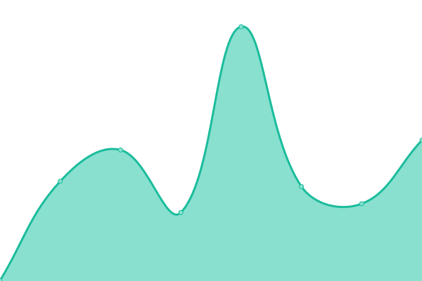
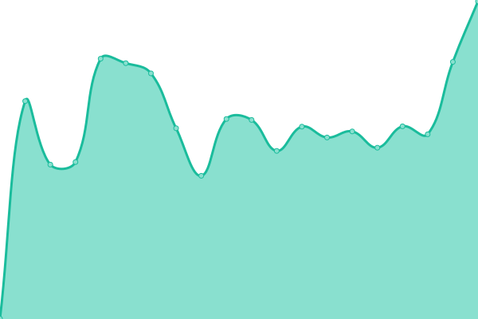

# FTRPRF monitor

## <!--live status--> **🟩 All systems operational**

<!--start: status pages-->
<!-- This summary is generated by Upptime (https://github.com/upptime/upptime) -->
<!-- Do not edit this manually, your changes will be overwritten -->
<!-- prettier-ignore -->
| URL | Status | History | Response Time | Uptime |
| --- | ------ | ------- | ------------- | ------ |
|  [Production - FTRPRF - API](https://education.ftrprf.be/swagger-ui.html#/) | 🟩 Up | [production-ftrprf-api.yml](https://github.com/FTRPRF/monitor/commits/master/history/production-ftrprf-api.yml) | 

 625ms
     
 | 

<a href="https://status.ftrprf.be/history/production-ftrprf-api">100.00%</a>
    

|  [Production - FTRPRF - APP](https://schools.ftrprf.be/#/) | 🟩 Up | [production-ftrprf-app.yml](https://github.com/FTRPRF/monitor/commits/master/history/production-ftrprf-app.yml) | 

 392ms
     
 | 

<a href="https://status.ftrprf.be/history/production-ftrprf-app">100.00%</a>
    

|  [Production - STUDIO FTRPRF - APP](https://studio.ftrprf.be/) | 🟩 Up | [production-studio-ftrprf-app.yml](https://github.com/FTRPRF/monitor/commits/master/history/production-studio-ftrprf-app.yml) | 

 461ms
     
 | 

<a href="https://status.ftrprf.be/history/production-studio-ftrprf-app">100.00%</a>
    

|  [Production - STUDIO CodeFever - APP](https://studio.codefever.be/) | 🟩 Up | [production-studio-code-fever-app.yml](https://github.com/FTRPRF/monitor/commits/master/history/production-studio-code-fever-app.yml) | 

 278ms
     
 | 

<a href="https://status.ftrprf.be/history/production-studio-code-fever-app">100.00%</a>
    

|  [Test - FTRPRF - API](https://test-education.ftrprf.be/swagger-ui.html#/) | 🟩 Up | [test-ftrprf-api.yml](https://github.com/FTRPRF/monitor/commits/master/history/test-ftrprf-api.yml) | 

 675ms
     
 | 

<a href="https://status.ftrprf.be/history/test-ftrprf-api">80.70%</a>
    

<!--end: status pages-->

[**Visit our status website →**](https://ftrprf.github.io/monitor)
